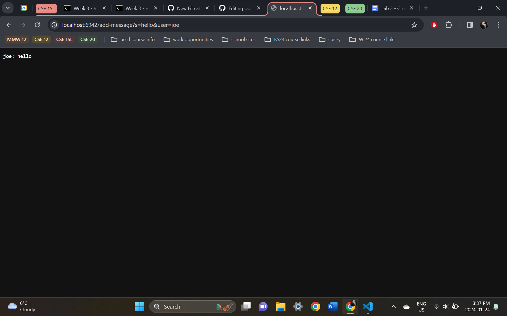
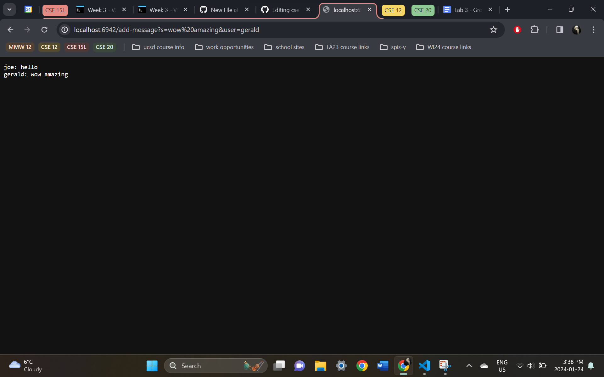
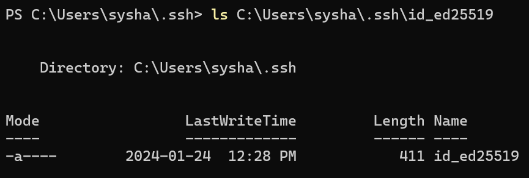
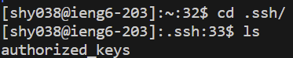
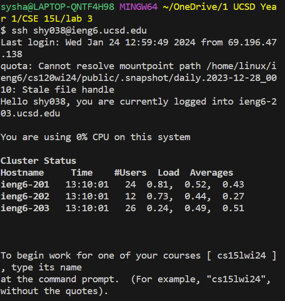

# lab 3 report :)

## pt 1

**ChatServer.java**
```
import java.io.IOException;
import java.net.URI;

class Handler implements URLHandler {
    String chat = "";

    public String handleRequest(URI url) {
        if (url.getPath().equals("/")) {
            return chat;
        } else {
            if (url.getPath().contains("/add-message")) {
                String[] parameters = url.getQuery().split("&");
                String[] messageInfo = parameters[0].split("=");
                String[] userInfo = parameters[1].split("=");
                if (messageInfo[0].equals("s") && userInfo[0].equals("user")) {
                    chat = chat + userInfo[1] + ": " + messageInfo[1] + "\n";
                }
                return chat;
            }
            return "404 Not Found!";
        }
    }
}

class ChatServer {
    public static void main(String[] args) throws IOException {
        if(args.length == 0){
            System.out.println("Missing port number! Try any number between 1024 to 49151");
            return;
        }

        int port = Integer.parseInt(args[0]);

        Server.start(port, new Handler());
    }
}
```



- calls `handleRequest`, where the url is the argument
- updates `chat` from empty to `"joe: hello\n"`



- calls `handleRequest`, where the url is the argument
- also updates `chat` from `"joe: hello\n"` to `"joe: hello\ngerald: wow amazing"`


# pt 2
private key


public key


terminal interaction


# pt 3
I knew very little about the concept of ports prior to last week's lab. I also thought little about how urls were processed in general, so it was helpful to have the comparison to file paths, as well as the breakdown of what functions different parts of the url serve.
