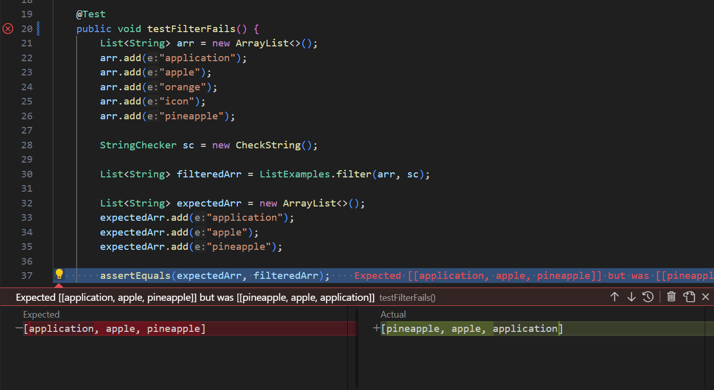

# lab 5 report :)

## pt 1

**input**
```
class CheckString implements StringChecker {
    CheckString() { }
    public boolean checkString(String s) {
        if (s.contains("app")) {
            return true;
        } else {
        return false;
        }
    }
}

public class ListTests {
    
    @Test
    public void testFilterFails() {
        List<String> arr = new ArrayList<>();
        arr.add("application");
        arr.add("apple");
        arr.add("orange");
        arr.add("icon");
        arr.add("pineapple");

        StringChecker sc = new CheckString();

        List<String> filteredArr = ListExamples.filter(arr, sc);

        List<String> expectedArr = new ArrayList<>();
        expectedArr.add("application");
        expectedArr.add("apple");
        expectedArr.add("pineapple");

        assertEquals(expectedArr, filteredArr);
    }

    @Test
    public void testFilterPasses() {
        List<String> arr = new ArrayList<>();
        arr.add("application");
        arr.add("orange");
        arr.add("icon");

        StringChecker sc = new CheckString();

        List<String> filteredArr = ListExamples.filter(arr, sc);

        List<String> expectedArr = new ArrayList<>();
        expectedArr.add("application");

        assertEquals(expectedArr, filteredArr);
    }
}
```
**symptom**



**bug**
original method
```
static List<String> filter(List<String> list, StringChecker sc) {
    List<String> result = new ArrayList<>();
    for(String s: list) {
      if(sc.checkString(s)) {
        result.add(0, s);
      }
    }
    return result;
  }
```
fixed ver.
```
static List<String> filter(List<String> list, StringChecker sc) {
    List<String> result = new ArrayList<>();
    for(String s: list) {
      if(sc.checkString(s)) {
        result.add(s);
      }
    }
    return result;
  }
```

The desired output of the ```filter()``` method is a new list of strings that fit the StringChecker's criteria, in order of appearance in the inputted list of strings. The original line of code where a string is added to the new list, however, adds the string at index 0, causing it to be prepended and reversing the order. (This is also why the input with only one string fitting the StringChecker's criteria seemingly produces no error.) Removing the index parameter from the ```add()``` call causes it to default to appending the given element, fixing the order.

